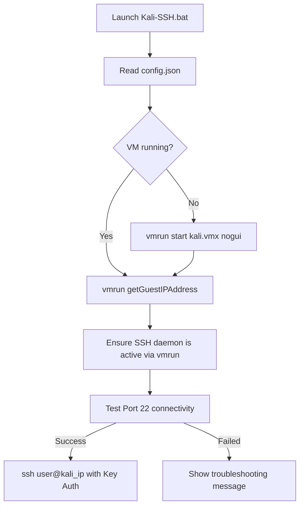

<p align="center">
  <h1 align="center">⚡ KALI-SSH ⚡</h1>
  <p align="center">
    <b>Automated, One-Click SSH Bridge from Windows to VMware Kali Linux</b>
  </p>
  <p align="center">
    
    
    <a href="https://t.me/jc_org"></a>
    
    
    
  </p>
</p>

```text
 ======================================================================
  _  __    _    _     ___        ____ ____  _   _ 
 | |/ /   / \  | |   |_ _|      / ___/ ___|| | | |
 | ' /   / _ \ | |    | | _____ \___ \___ \| |_| |
 | . \  / ___ \| |___ | ||_____| ___) |___) |  _  |
 |_|\_\/_/   \_\_____|___|      |____/|____/|_| |_|

                       [ OWNER : ENC ]
                  [ Telegram : t.me/jc_org ]
            Kali Linux Auto-Connector & SSH Bridge
 ======================================================================
```

---

## 📌 Overview
**KALI-SSH** is a lightweight, zero-overhead automation utility for Windows designed to streamline and automate your workflow with Kali Linux running on **VMware Workstation**.

Instead of manually starting VMware Workstation, waiting for the desktop interface to boot, checking the guest IP address, and starting the SSH service inside the VM, **KALI-SSH** handles the entire lifecycle with a single click.

---

## ✨ Features

- 🚀 **1-Click Launch:** Simply double-click `Kali-SSH.bat` from your Windows desktop to connect instantly.
- 🤖 **Auto-Boot Headless:** If the virtual machine is powered off, KALI-SSH powers it up silently in the background (`nogui` mode) to save system resources.
- 🌐 **Dynamic IP Acquisition:** Automatically extracts the guest IP address via VMware Tools (`vmrun getGuestIPAddress`) without requiring static IP configuration.
- 🔒 **Remote SSH Daemon Activator:** Remotely checks and starts the OpenSSH server (`systemctl enable --now ssh`) inside Kali if it is inactive.
- 🔑 **Passwordless Ed25519 Authentication:** Includes a one-click setup script to generate and deploy SSH keys directly to Kali's `authorized_keys`.
- 💬 **Interactive Configuration Wizard:** Prompts the user interactively on first run for VM path and credentials, automatically saving preferences to `config.json`.
- ⚙️ **Configurable & Portable:** Customizable settings via `config.json` with fallback defaults.

---

## 📋 Prerequisites

Before running KALI-SSH, make sure you have:

1. **Windows 10 / 11** with OpenSSH client enabled (built-in by default).
2. **VMware Workstation Pro / Player** installed.
3. **VMware Tools** (`open-vm-tools`) installed and running on the Kali Linux guest:
   ```bash
   sudo apt update && sudo apt install -y open-vm-tools
   ```

---

## 🚀 Quick Start & Installation

### 1. Clone the Repository
```powershell
git clone https://github.com/erfanevil/KALI-SSH.git
cd KALI-SSH
```

### 2. First-Time Setup (Key Exchange)
Run the setup wizard to exchange SSH keys and configure your VM credentials:
```powershell
powershell -ExecutionPolicy Bypass -File setup.ps1
```
* The wizard will prompt you for your Kali `.vmx` path, username, and password.
* It generates a secure Ed25519 keypair and uploads the public key to Kali Linux.
* Credentials and paths are saved locally to `config.json`.

### 3. Connect to Kali
Whenever you want to access your Kali environment, simply execute:
```cmd
Kali-SSH.bat
```
or double-click the file in Windows Explorer.

---

## ⚙️ Configuration (`config.json`)

You can modify your environment parameters directly in `config.json`:

| Parameter | Type | Description | Default Example |
| :--- | :--- | :--- | :--- |
| `vmx_path` | String | Full path to the Kali Linux `.vmx` file | `C:\linux\kali.vmx` |
| `vmware_path` | String | Full path to VMware `vmrun.exe` | `C:\Program Files\VMware\VMware Workstation\vmrun.exe` |
| `guest_username` | String | Kali Linux account username | `kali` |
| `guest_password` | String | Kali Linux account password | `kali` |
| `fallback_ip` | String | Fallback IP if DHCP discovery is delayed | `192.168.1.100` |
| `auto_start_vm` | Boolean | Whether to boot the VM if it is offline | `true` |
| `ssh_port` | Integer | SSH port | `22` |

```json
{
  "vmx_path": "C:\\path\\to\\your\\kali.vmx",
  "vmware_path": "C:\\Program Files\\VMware\\VMware Workstation\\vmrun.exe",
  "guest_username": "your_username",
  "guest_password": "your_password",
  "fallback_ip": "192.168.1.100",
  "auto_start_vm": true,
  "ssh_port": 22
}
```

---

## 🛠️ Project Structure

```text
KALI-SSH/
├── Kali-SSH.bat        # Windows 1-click batch launcher
├── kali_connect.ps1    # Core engine (detect, boot, get IP, start SSH, connect)
├── setup.ps1           # Initial setup & passwordless SSH key deployment
├── config.json         # Local configuration file
├── .gitignore          # Ignores sensitive keys, temp files, and caches
├── LICENSE             # MIT License
└── README.md           # Documentation
```

---

## 🔍 How It Works



---

## 👤 Author & Credits

- **Developer:** **EncDev** ([@encdev](https://github.com/erfanevil))
- **Brand / Owner:** **ENC**
- **Telegram Channel & Support:** [@jc_org](https://t.me/jc_org)

---

## 📄 License

This project is licensed under the [MIT License](LICENSE). Feel free to use, fork, and contribute!
